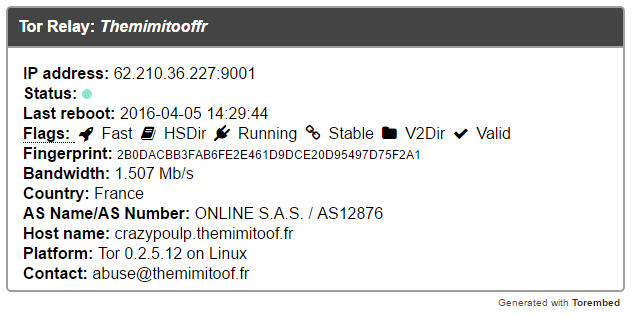
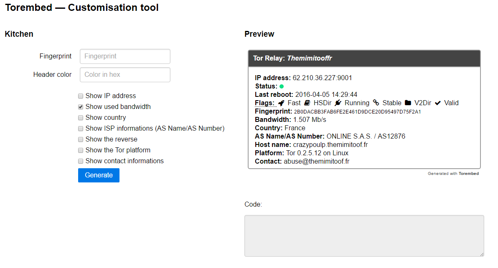

# Torembed : Embed your Tor relay informations on your website!
Torembed is a simple script tor help us tor embed informations of your relay on your website.



# Prerequisites
    * Server running PHP (5.6>=)
    * Extension php_openssl enabled (for _https_ calls)

# How to use
To generate Torembed widget, you have two possibilities: using the _generator_, call directly the URI with specific variables.

## (__Basic__) Using the generator (The _Kitchen_)
The generator is a simple tool to generate the ```<iframe>``` code easily.



In the generator, you only need to specify the _Fingerprint_ of the Tor relay. If you likely, it's possible to edit the background color of the header specifying a hexadecimal color and choose all of the visible informations into the widget.

On clicking in the button, you have the preview and the code to add on your website.

__Nota:__ It is best that you put the address of your server in the ``ServerUri`` variable at the end of index.html. Example:
```
...
Line 111:

<script type="text/javascript">
            console.log(window.location.href)
            function generate() {
                    var ServerURI = "https://themimitoof.fr/torembed/"; // <- EDIT THIS LINE AND ADD THE SERVER ADDRESS HERE
                    var URI = ServerURI + "embed.php";
                    // Check the fingerprint input
                    if($("#fingerprint").val() != "") {

...
```


## (__Advanced__) Making the URI
If you prefer to make the URI, you need first to call the _embed.php_ file with a ```fingerprint``` variable. For example:
```
https://themimitoof.fr/torembed/embed.php?fingerprint=PAST_THE_FINGERPRINT_HERE
```
After that, it is possible to add information to the widget by adding / editing variables below in the URI:

 * ```ip``` : (Type: _boolean_) _display or not the server IP_
 * ```bandwidth``` : (Type: _boolean_) _display or not the server bandwidth_
 * ```country``` : (Type: _boolean_) _display or not the server country_
 * ```as_info``` : (Type: _boolean_) _display or not the Autonomous informations (AS Name/AS Number)_
 * ```hostname``` : (Type: _boolean_) _display or not the server hostname (reverse)_
 * ```platform``` : (Type: _boolean_) _display or not the Tor version used by the server_
 * ```contact``` : (Type: _boolean_) _display or not the contact informations_
 * ```head_color``` : (Type: _string_) _Change the background_color of the header of the widget. The value of this variables is in **hexadecimal without the** ``#`` **character**. _  


Example to show ``ip``, ``bandwidth``, ``as_info``, ``platform`` and edit ``head_color``:

```
https://themimitoof.fr/torembed/embed.php?fingerprint=PAST_THE_FINGERPRINT_HERE&ip=1&bandwidth=1&as_info=1&platform=1&head_color=3848BB
```


# Can i remove the _Generated with Torembed_ on the bottom?
Yes you can. This project is open source but, you don't have the permission to delete the comments into the differents files or declare that the project was created by yourself. However, let this line helps to support this project and allow other people to use this tool.

To remove this line, you need to remove or comment this line on the _embed.php_ file:
```html
<p class="footer">Generated with <b><a href="https://themimitoof.fr/torembed" target="_blank">Torembed</a></b></p>
```

# ToDo
 * Show the _uptime server_ and not the _last reboot_.
 * Set automatically the server URI on the generator
 * Add some informations for relays
 * Show informations for bridges servers
 * Features from futures feedbacks, issues and pull requests ;)

# Feedback
If you like this project are you likely to suggest new functionalities, don't hesitate to open issue. If you likely to contribute to this project, fork this repo and give me a pull request ;)
